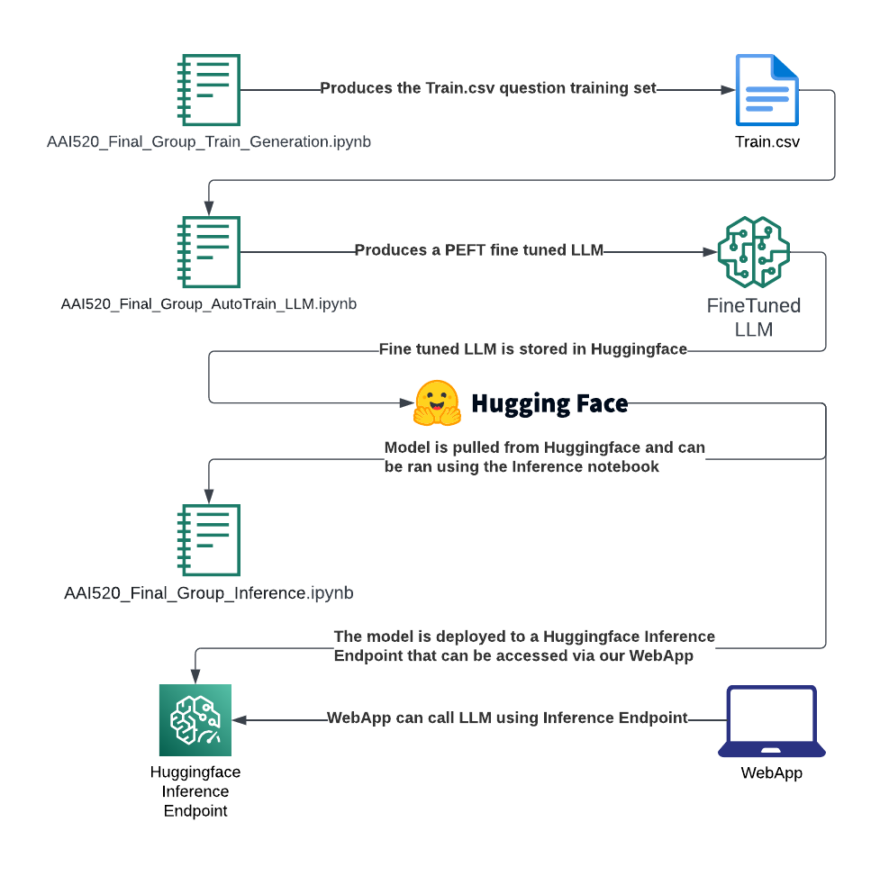

# AAI-520 Fall 2023 Group 6
AAI 520 Final ChatBot Project
Group 6
Members: Paul Parks, Alden Caterio, Adam Graves
Due Date: 10/23/2023

Try it out: 
https://msaai-520-final-project-web-app.vercel.app/

## Project Overview:
### Goal:
 Design and build a chatbot that can carry out multi-turn conversations, adapt to context, and handle a variety of topics.
### Output: 
A web or app interface where users can converse with the chatbot.
### Deliverables:
For the final project submission, it is required to use GitHub. Ensure that you will create a dedicated repository for your project and use this for all your submissions. Embracing this approach will not only streamline our assessment process but will also equip you with a vital skill set valued in the tech industry.
Your submission within Canvas will contain the following deliverables:
1.	A link to the final project's GitHub repository.  
2.	A working generative chatbot accessible via Notebook and/or accessible through a web interface (include the link in your submission and report). Your Notebook should be in PDF or HTML format.
3.	A brief report in PDF detailing:
•	Challenges faced and solutions implemented.
•	Model architecture and rationale behind the chosen design.
•	Evaluation results and user feedback.
•	Future improvements and scalability options.
•	Write and submit your final project report in APA 7 style (sample professional paper Download sample professional paper). The final report (without Appendices), including text and selected tables/graphs, should be 3-5 pages. You will use the naming convention Final Project Report-Team Number.pdf (e.g., Final Project Report-Team 1.pdf).
4.	Presentation: For the completion of your final project, students will be required to prepare and record a presentation Download record a presentationthat unfolds in the form of a captivating story, detailing their development, findings, and any relevant recommendations or conclusions. Visuals are required in the video presentation, which should be 5-7 minutes. A Demo of your chatbot and how it works is recommended. This presentation should also include one slide to showcase your collaborative efforts; you will create a slide highlighting each team member's individual names and their contributions to the final project work and deliverables.
•	
o	
	Note: It is recommended that you follow Garr Reynolds’ adviceLinks to an external site. on how to design effective presentations. Since this presentation is a narrated presentation, it is a best practice to create a script beneath each slide in speaker notes if in PowerPoint or on an external document if screen capturing using other software. The scripts will help you when recording the narration.

# Architecture


# How to fine tune the LLM
1. `AAI520_Final_Group_Train_Generation.ipynb` is used to generate the training dataset that is stored in Train.csv
2. After creating the Train.csv, `AAI520_Final_Group_AutoTrain_LLM.ipynb` is used to fine tune the Meta LLaMA LLM using the training questions. 
3. Finally, the fine tuned LLM can be ran using `AAI520_Final_Group_Inference.ipynb`

# How to run WebApp
The Next.js webapp is located in ./MSAAI-520-FinalProject-WebApp

This is a modified version of the Vercel AI Chatbot application: https://github.com/vercel-labs/ai-chatbot

```bash
pnpm install
pnpm dev
```

The WebApp is available for use: 
https://msaai-520-final-project-web-app.vercel.app/

Note: The LLM is ran using Huggingface Inference Endpoint and may be turned off to not incur any costs. If you would like a demo please reach out to pparks@sandiego.edu

# meeting #1: 9/20/2023 @ 4:00 PM
Agenda:
• Introductions
• Select the data corpus: **Selected the Movie corpus**
• Brainstorm UI and functions
• Allocate who does what as a guideline (Resource allocation)
• Start a schedule - timelines
• Schedule the next task and schedule (What are we doing next, Who is doing what, Who is testing, date for completion)(Scrum/Sprint style)
• Next call: **9/26/2023 @ 5:00 PM**
# meeting #2: 9/26/2023 @ 5:00 PM
Agenda:
• Review the Strategy
• Discuss the theme of the Chatbot
• Discuss if we can or should use pre-trained models
• Discuss how the input is dealt with
• Discuss how the output should or can be
• Assign tasks: Paul: Find out on the pre-trained data, review building the web chatbot GUI, Adam: Update documentation, research ETL and normalization, Alden: Prepare more info on the Chatbot output options
• Next call: **9/29/2023 @ 3:00 PM**
# meeting #3: 10/02/2023 @ 12:15 PM
Agenda:
- Go over the data load
- Discuss the hi level operational flow
- Discuss current obstacles
- Discuss option and what R&D anyone in the team has done
- Decide on next steps**
-   Steps:
-   1. Get list of questions we to train
    Potitive case
        - What year was movie X released?
        - What was the rating of movie X released?
    Negative cases
        - What is your favorite food?
            - Response: I am a movie bot and cannot comment on food
2. Write code to create the train csv with the question
3. Train with autotrain
4. Run fine tuned model
Optional:
5. Running the fine tuned model
- Host on server with GPU
- One potential solution: running on huggingface
- Adam and Alden to provide Paul with bot related questions that Paul will use to build a csv file from the movie df we created and make this the file to train the LLM, Due 10/3/23
# 10/4/2023 # Progress on pre-trained testing
- Paul has loaded a version of hugging face and test a chatbot operation on a pre-trained model
- Adam and Alden prepared a large movie (formatted) dataset to load onto the pre-trained model to train it with our specific movie data
-     Question and Answers were prepared on:
-         # What year was the movie {} released in? - add year just in case
          # what is the rating on the movie {}?
          # what is the genres on the movie {}?
          # how many votes did the movie {} receive?
          # who are the characters in the movie {}?
          # what gender is the character {} in the movie {}?
          # do you have the full script for the movie {}? (Gives the url link)
          # what are some line that {} said in the movie {}?
- Testing and reults due 10/5/2023
- Obstacles: the Accelerator gives problems on Coloab
- GitHub updated with all file
# meeting #4: 10/06/2023 @ 05:00 PM
Agenda:
- Paul presented the pre-trained work done with Hugging Face
- Adam and Alden presented the question and answer data file produced
- Discussion on how the pre-trained model is updated with our Q&A data file
- Paul discussion on the Chabot front-end options
- Update documentation
- Update Project Management
- Next neeting discuss pre-trained progress and front-end Chatbot, also the presentation method


